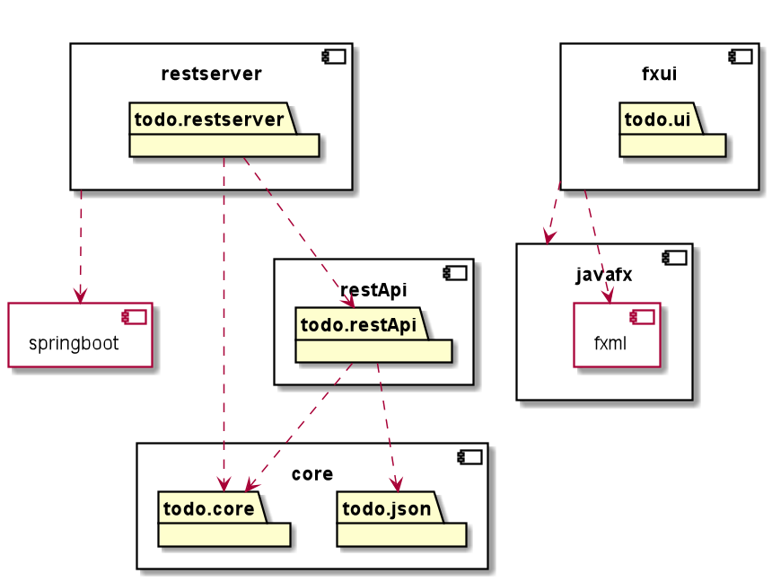

README.MD
===

## Table of Contents

[TOC]

## Organisering av koden
Dette prosjektet tar for seg bygging av en TODO-liste. Det er en trelagsapplikasjon med domenelag, UI og lagring. Gradle blir brukt som byggesystem.

For core:

* `src/main/java` for koden til kjernelogikken

* `scr/main/resources` for tilhørende ressurser, f.eks. data-filer og FXML-filer, som brukes av applikasjonen.

* `scr/test/java` for testkoden

* `scr/test/resources` for tilhørende ressurser, f.eks. data-filer og FXML-filer, som brukes av testene.

For fxui:

* `src/main/java/todoui` for kontrollerklasse og applikasjonsklasse
* `src/main/resources` for fxml-fil

for restapi:
* `src/main/java/restAPI/Controllers` for kontrollklasse
* `src/main/java/restAPI` for applikasjonsklasse 

Domenelaget
---
Vår applikasjon lagrer oppgaver i en liste (TODO-liste). Domenelaget inneholder klasser som håndterer disse oppgavene. 

Brukergrensesnitt
---

Brukergrensesnittlaget inneholder alle klassene som tar for seg user-interface, og hvordan de representes gjennom visningen av data i applikasjonen.

Brukergrensesnittet er laget med JavaFX og FXML. Det finner man i `fxui/src/main/java/todoui` for kontroller og app-klassen. FXML-fila finnes i `fxui/src/resources`

Lagring
---

Lagringsaget (persistenslaget) inneholder klasser for lagring av data. Det foregår i modulene restApi

Testing
---
Du kan teste appen ved å kjøre `gradle check`, og få ut testdekningsgrad ved hjelp av `gradle jacocoTestReport`, da vil rapporten ligge i `build/reports/jacoco/test/html/index.html`.

##Artkitektur

###### tags: `Readme` `Documentation` `IT1901`
